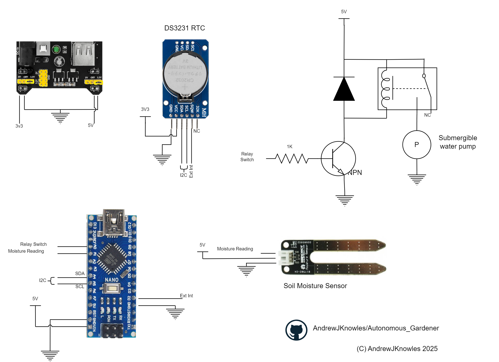
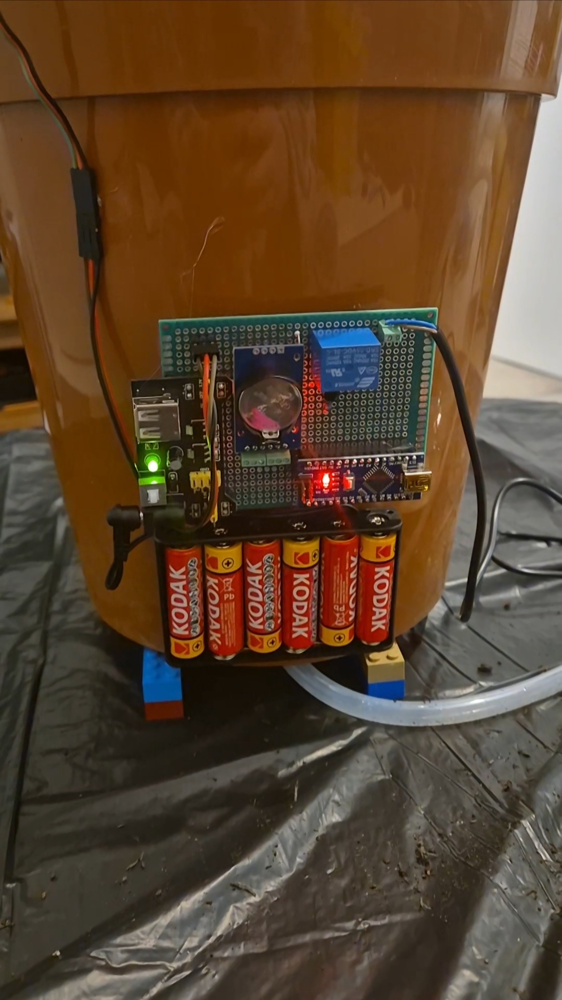

# **Autonomous Gardener**

| Field         | Comment         |
|---------------|-----------------|
| Platform      | Arduino Nano    |
| IDE           | Arduino v2.3.4  |
| Author        | AndrewJKnowles  |
| Date Created  | 29/30/2025      |
| Version       | v1.0            |
| Last Uppdated | |
| Updated By    | |
| License       | GPL-3.0 License |

  

## **Brief**

The Automonous Gardener utilises an Ardiouno Nano to check the soil moisture content to determine if it should action the watering functionality. The watering process consits of activating a relay for 10 seconds to allow a pump to deliver water to the affected area. To aid the reduction of power consumption, a Real Time Clock (RTC) provides an external interrupt at a rate of 1Hz, waking up the Nano to increment its internal counter. By default, the measurement interval is 1 minute.

  

## **Hardware**

- Breadboard power supply module
- DS3231 RTC
- Relay (and protection diode)
- NPN transistor
- Water pump
- Moisture sensor

  

### **Schematic**

  

## **Prototype Product**

